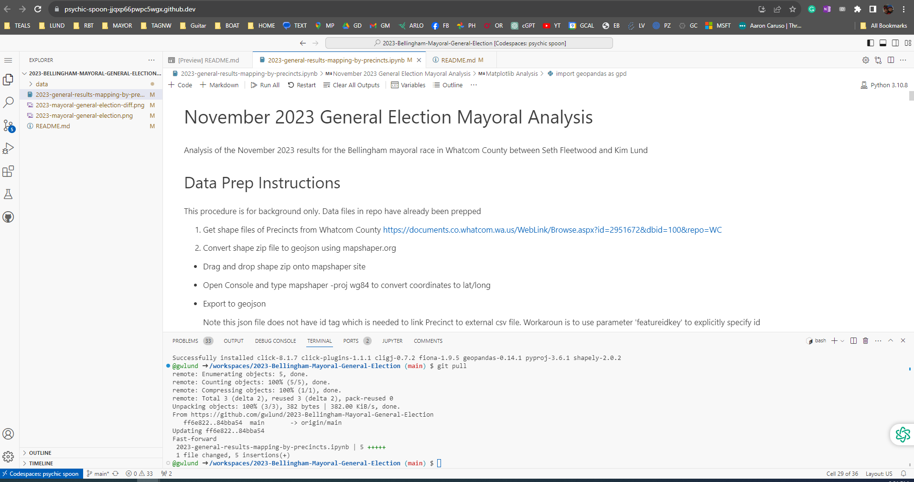

# 2023-Bellingham-Mayoral-General-Election
Analysis by precinct of the Bellingham Mayoral election between Kim Lund and Seth Fleetwood.

Fastest way to provision jupyter notebook is to use github codespaces through the Code button.  Once environment spins up then configure kernal and setup python to 3.10.8.  Lastly, pip install geopandas from the terminal and then run the notebook.

Here is what the codespace IDE looks like

Here are the primary plots from the end of the notebook

Delta precent (Kim - Seth)

